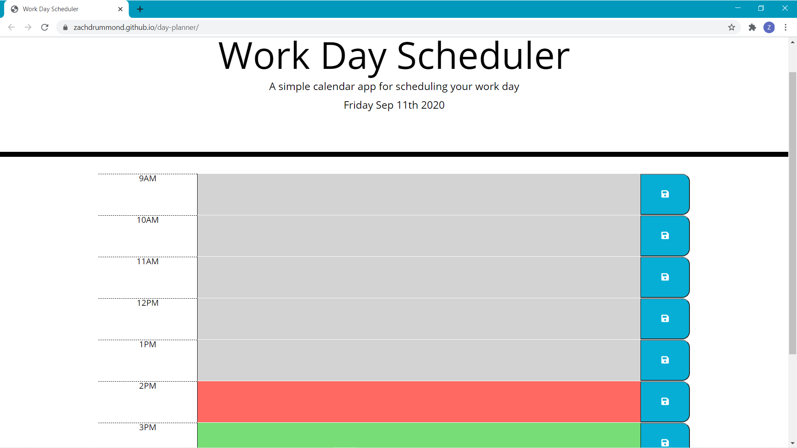
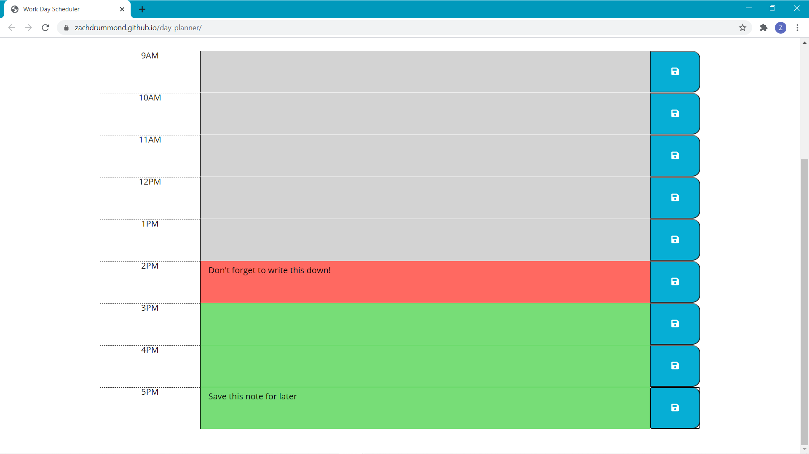
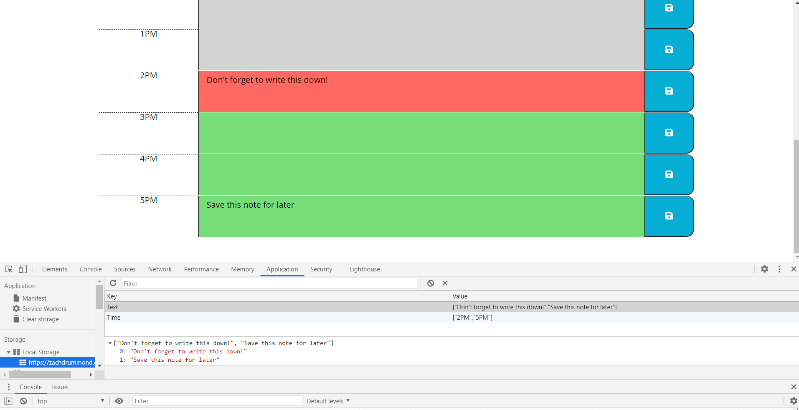

# day-planner

## Table of Contents
* [Description](#Description)
* [Design Elements](#Design-Elements)
* [App Preview](#App-Preview)
* [Links](#Links)
* [Credits](#Credits)

## Description
This is an app that creates a personal daily calendar or scheduler which allows the user to schedule events for each hour of the day. These days, everyone has a busy schedule. Now you can manage your time more effectively with your very own personal daily planner!

### *Usage*
1. Click a time-block text area to add an events or notes.
2. Click the blue save button to save any notes you add.
Your notes will be saved, even if you exit out of the app.

## Design Elements
### *JavaScript*
* Clean User Interface
* Dynamically Updated HTML and CSS powered by jQuery
* Moment.js API
* Google Fonts API
* JSON
* Logical Code Structure
* Sequential Order
* Web Application Programming Interface
* Document Object Model Manipulation
* Local Storage
* Objects
* Arrays
* Methods
* Global and Local Variables
* Functions
* Event Listeners
* Interval
* if...else Statements
* for Loops
* Comments

### *Bootstrap*
* Grid System
* Jumbotron
* Spacing

### *HTML*
* Logical Structure
* Sequential Order
* Bootstrap CSS Link
* CSS File Link
* JavaScript File Link
* Concise Descriptive Title
* Semantic Elements
* ids, Classes, and Elements
* Buttons
* Accessible Attributes
* Comments

### *CSS*
* Background
* Height
* Border
* Padding & Margin
* Font
* Alignment
* Colors
* Comments

## App Preview
### *Day Planner*

### *Notes*

### *Local Storage*

## Links
* Website: https://zachdrummond.github.io/day-planner/
* GitHub Repository: https://github.com/zachdrummond/day-planner

## Credits
* jquery - https://api.jquery.com/
* Moment.js - https://momentjs.com/
* Font Awesome - https://fontawesome.com/
* Google Fonts - https://fonts.google.com/
* Bootstrap: https://getbootstrap.com/
* Classmate, Andrew Siegel, helped by talking through the logic of displaying, storing, and coloring the correct time.
