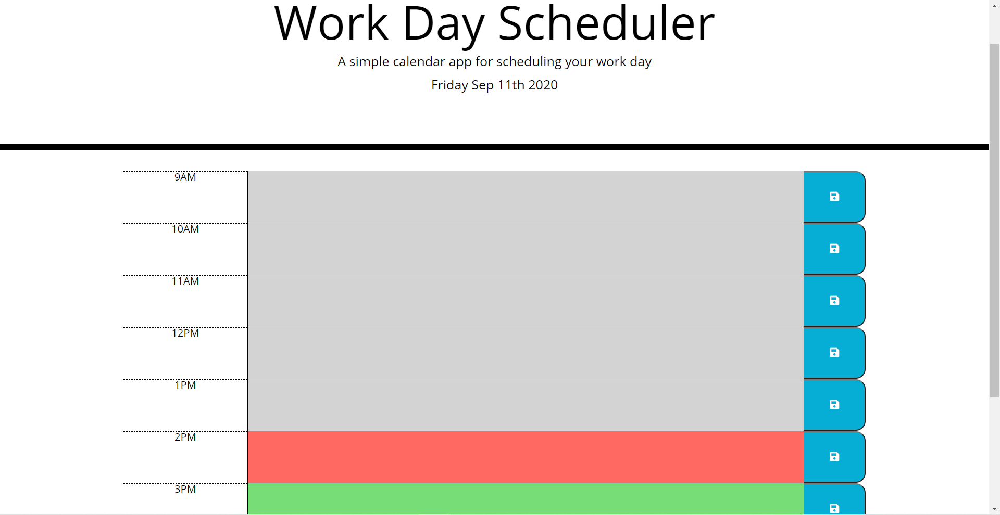
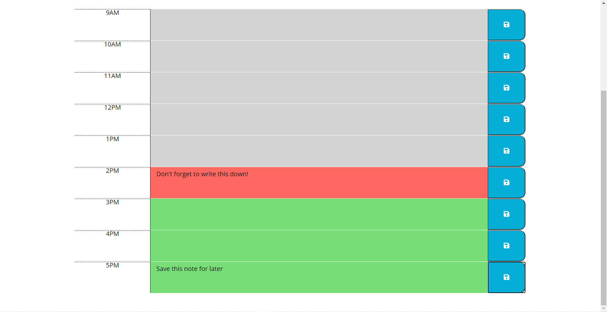

# day-planner

## Table of Contents
* [Description](#Description)
* [Links](#Links)
* [Design Elements](#Design-Elements)
* [App Preview](#App-Preview)
* [Credits](#Credits)

## Description
This is an app that creates a personal daily calendar or scheduler which allows the user to schedule events for each hour of the day. These days, everyone has a busy schedule. Now you can manage your time more effectively with your very own personal daily planner!

## Links
* Website: https://zachdrummond.github.io/day-planner/
* GitHub Repository: https://github.com/zachdrummond/day-planner

### *Usage*
1. Click a time-block text area to add an events or notes.
2. Click the blue save button to save any notes you add.
Your notes will be saved, even if you exit out of the app.

## Design Elements
* JavaScript
* jQuery
* Moment.js API
* Local Storage
* HTML
* CSS
* Bootstrap

## App Preview
### *Day Planner*

### *Notes*

### *Local Storage*

## Credits
* jquery - https://api.jquery.com/
* Moment.js - https://momentjs.com/
* Font Awesome - https://fontawesome.com/
* Google Fonts - https://fonts.google.com/
* Bootstrap: https://getbootstrap.com/
* Classmate, Andrew Siegel, helped by talking through the logic of displaying, storing, and coloring the correct time.
